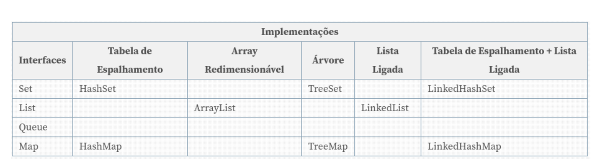

## Java Bootcamp2025

This session covered core Java concepts that form the foundation of object-oriented programming.

### Topics Covered

### Part 1

- **Void (Return Type)**: A method that does not return any value.
- **Abstract Class**: A class that cannot be instantiated directly.
- **Abstract Method**: A method that must be implemented by subclasses.
- **Extends (Inheritance)**: Allows a class to reuse and extend the functionality of a superclass.
- **Test Class**: Used to instantiate objects and test methods of other classes.
- **@Override**: An annotation used to indicate that a method has been overridden in a subclass, helping to avoid syntax errors.
- **Package Implementation**: Demonstrated the implementation of abstract classes, anonymous classes, and interfaces in various scenarios.
- **Anonymous Class**: A class without a name, instantiated directly.

  ```java
    
  abstract class Animal {
    abstract void makeSound(); // Abstract method

    void breathe() { // Concrete method
        System.out.println("Breathing...");
    }
  
  //anonymous class
    Account savingsAccount = new Account(){
        @Override
        public void printAccountType() {
            System.out.println("Savings Account");
        }
    };

### Part 2

- **Access Modifiers**: Define the visibility and accessibility of classes, methods, and variables in Java.


- **Lombok**: A Java library that reduces boilerplate code by automatically generating common methods.
  - `@Getter` / `@Setter` → Generates getter and setter methods.
  - `@AllArgsConstructor` → Creates a constructor with all fields.
  - `@NoArgsConstructor` → Creates a no-argument constructor.
  - `@Builder` → Enables the builder pattern.


- **LocalDate**: A class from `java.time` used for handling dates without time zones.


### Part 3

- **Optional<T>**:  is a container object which may or may not contain a non-null value.
- **Collections**:   implementations for data structures



- **Unit Testing (@Test)**:  JUnit is used to write unit tests in Java.
- **Stream API**: Used for functional-style operations on collections.
- **Convert `for` to `for-each` and Stream**: Replacing traditional loops with modern iteration approaches.
- **Switch Case**: A control statement for handling multiple conditions.
- **Method Overloading**: Same method name with different parameters and behaviors.
- **Method Overriding**: Redefining a superclass method in a subclass.
- **For-each Loop**: A simplified loop for iterating over collections.

Code Examples

####  Traditional for loop to for-each

  ```java
//traditional loop    
for(int index = 0; index < contas.size(); index++) { // (1) Index initialization
    String conta = contas.get(index);  // (2) Access list using index
    if (filterLista(conta)) {          // (3) Condition check
        totalContas = totalContas + 1;  // (4) Counter Update
    }
}

//for-each
for (String conta : contas) {          // (1) Removes index and iterates direcly over elements
    if (filterLista(conta)) {          // (2) C*ondition check
        totalContas++;                  // (3) Counter update
    }
}


